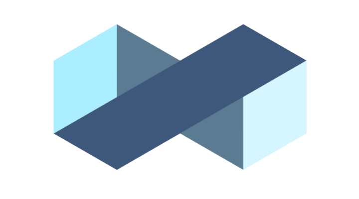

<!--
parent:
  order: false
-->

<div align="center">
  <h1> Planq </h1>
</div>



<div align="center">
  <a href="https://github.com/planq-network/planq/releases/latest">
    
  </a>
  <a href="https://github.com/planq-network/planq/blob/main/LICENSE">
    
  </a>
  <a href="https://pkg.go.dev/github.com/planq-network/planq">
    
  </a>
  <a href="https://goreportcard.com/report/github.com/planq-network/planq">
    
  </a>
  <a href="https://bestpractices.coreinfrastructure.org/projects/5018">
    
  </a>
</div>
<div align="center">
  <a href="https://discord.gg/jGTPyYmpsq">
    
  </a>
  <a href="https://github.com/planq-network/planq/actions?query=branch%3Amain+workflow%3ALint">
    
  </a>
  <a href="https://codecov.io/gh/planq-network/planq">
    
  </a>
</div>

Planq is a scalable and interoperable Ethereum library, built on Proof-of-Stake with fast-finality using the [Cosmos SDK](https://github.com/cosmos/cosmos-sdk/) which runs on top of [Tendermint Core](https://github.com/tendermint/tendermint) consensus engine.

**Note**: Requires [Go 1.18+](https://golang.org/dl/)

## Installation

For prerequisites and detailed build instructions please read the Planq [Installation](https://docs.planq.network/validators/quickstart/installation.html) instructions. Once the dependencies are installed, run:

```bash
make install
```

Or check out the latest [release](https://github.com/planq-network/planq/releases).

## Quick Start

To learn how the Planq works from a high-level perspective, go to the [Introduction](https://docs.planq.network/about/intro/overview.html) section from the documentation. You can also check the instructions to [Run a Node](https://docs.planq.network/validators/quickstart/run_node.html).

## Community

The following chat channels and forums are a great spot to ask questions about Planq:

- [Planq Twitter](https://twitter.com/PlanqFoundation)
- [Planq Discord](https://discord.gg/jGTPyYmpsq)
- [Planq Reddit](https://reddit.com/r/planq_network)

## Contributing

Looking for a good place to start contributing? Check out some [`good first issues`](https://github.com/planq-network/planq/issues?q=is%3Aopen+is%3Aissue+label%3A%22good+first+issue%22).

For additional instructions, standards and style guides, please refer to the [Contributing](./CONTRIBUTING.md) document.
